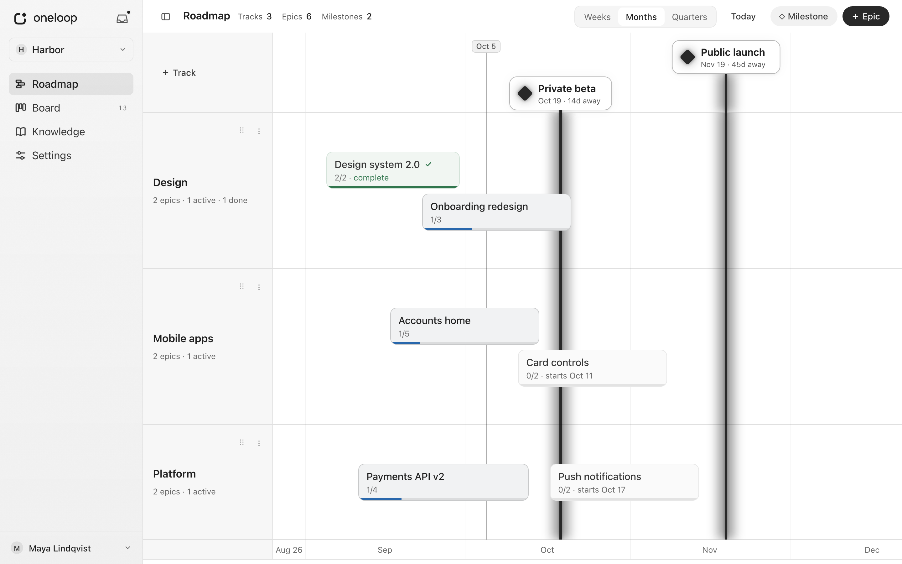
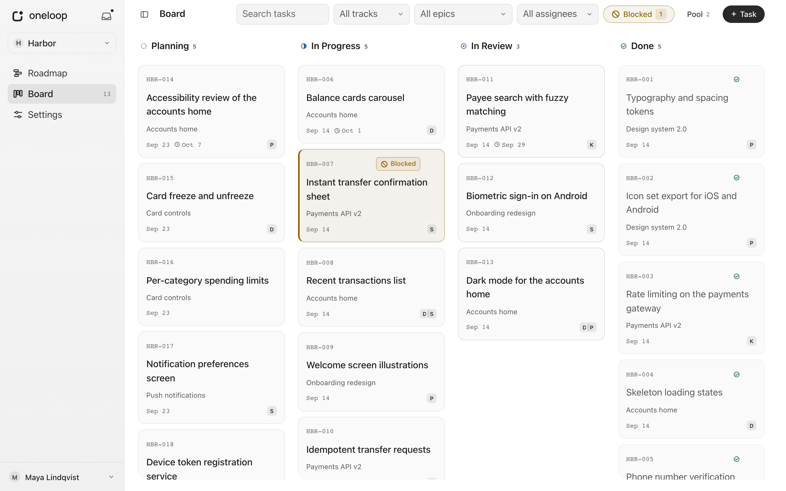
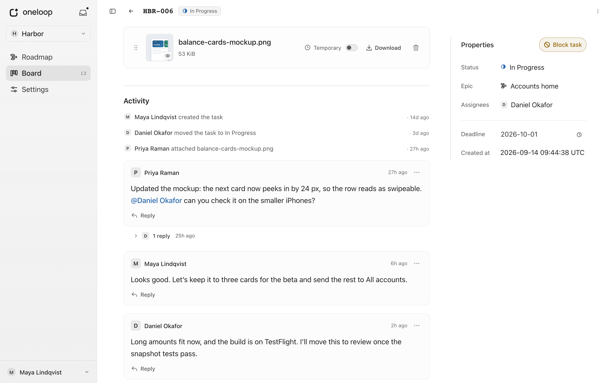

# User guide

## How work is organized

| Item | What it is | Example |
| --- | --- | --- |
| Project | All the work that one team plans together. Switch projects at the top of the sidebar. | Customer portal |
| Track | A long-running stream of work in a project. | Backend and API |
| Epic | A piece of work on one track, with a start date and an optional end date. | Payment integration |
| Milestone | A goal with a date, across all tracks. | Public launch |
| Task | One thing to do. Every task belongs to an epic. | Add card payments |

An epic without an end date is **ongoing**. Use ongoing epics for recurring
work, such as "Small fixes".

What you can change depends on your access to the project. Without the
**Roadmap** or **Board** permission, that page is **read only**, but you can
still comment. See [Permissions](admin-guide.md#permissions).

## Roadmap

The Roadmap shows epics and milestones on a timeline, with one row for each
track. It is the first page you see after you sign in.

- Scroll to move through time. To zoom, hold Ctrl (Cmd on macOS) while you
  scroll, or pinch on a touchpad or touch screen. **Today** takes you back to
  today.
- Hover over an epic or a milestone to see its details. Click an epic to open
  its progress, tasks and activity, or to edit it. Click a milestone to edit it.
- Add work with **+ Track**, **+ Epic** and **Milestone**. To reorder tracks,
  drag the grip next to a track's name, or use the arrow keys on it.
- You can delete a track only when it has no epics, and an epic only when it has
  no tasks.

### Epic status

| Status | Meaning |
| --- | --- |
| Planning | Not started yet. Every new epic starts here. |
| In progress | Work has started. oneloop sets this when one of the epic's tasks first moves to In Progress or In Review. |
| Done | Someone closed the epic with **Mark as done**. |

oneloop never closes an epic by itself, even when all its tasks are done. A Done
epic can't get new tasks, but its existing tasks can still change. **Reopen**
moves an epic back to In progress if some of its tasks are in progress or in
review, and to Planning otherwise.

An epic with an end date shows how many of its tasks are done. An ongoing epic
shows the tasks closed this week, closed since it started, and still open.
Weeks start on Monday.

## Board

The Board shows the project's tasks in four columns:

| Status | Meaning |
| --- | --- |
| Planning | Defined, but not started. New tasks start here. |
| In Progress | Someone is working on it. |
| In Review | Ready for someone to check. |
| Done | Complete. |

A task can move to any status at any time, for example back to In Progress after
a review.

- **+ Task** creates a task. It needs a title and an epic that isn't Done.
- Drag a card to change its status or its place in the column. On a touch
  screen, drag it by its **⋯** button. The **⋯** menu can also move it, which
  works well with a keyboard.
- Use the filters to find tasks by text, track, epic or assignee, or to show
  only blocked tasks. Several choices in one filter show more tasks; several
  filters together show fewer.
- **Newest first**, at the top of **Done**, lists the most recently finished
  tasks first. Each browser remembers this choice. While it is on, a task you
  move to Done goes to the top, and you can't reorder Done by hand. The manual
  order stays as it was for when you turn it off.

### Pool

The **Pool** holds ideas that aren't tasks yet. An idea has a title and an
optional description. Your **My** Pool is private, even from admins. The
**Team** Pool is shared with the project. When an idea is ready, click it to
turn it into a task.

## Tasks

Click a card to open the task. Your changes save automatically.

- **Assignees** can be any project members. They get an Inbox notification when
  you assign them.
- **Deadline** is a date. When that day ends in your team's timezone, a task
  that isn't Done shows **Overdue**.
- **Activity** shows comments and changes in one timeline.
- If someone else changes a task field or comment while you are editing it,
  oneloop keeps your text and shows theirs next to it. Choose **Use latest** or
  **Keep my changes**.
- A title or description you change while offline stays on the page, marked
  **Not saved**, and saves when the connection returns.
- To delete a task, use the **⋯** menu at the top of the page.

### Blocking

When something stops the work, choose **Block task** and write the reason.
Mention people in the reason with `@` to notify them. The card then shows a
**Blocked** badge.

- The task keeps its status while it is blocked. **Unblock task** removes the
  block and notifies the assignees.
- Done tasks can't be blocked. If you move a blocked task to Done, oneloop asks
  you to unblock it first.

### Files

Drop files on a task, or click **browse files**. Any file type is fine, within
the [file limits](reference.md#limits). Everyone in the project can open the
files. Comments can't have files.

Click a file to preview it. oneloop shows images, PDFs, Markdown (with tables,
math and Mermaid diagrams), HTML pages, text and code. You can download any
file.

HTML previews show the page without running its scripts or loading anything
from other sites, such as images, styles and fonts. Styles, images and fonts
inside the file still show. To use the page fully, download it.

Mark a file **Temporary** if oneloop may remove it when storage runs low. A
removed file then shows **Cleaned up**. oneloop never removes other files by
itself.

### Undo a deletion

After you delete a task, a file or a comment, the message that confirms it has
an **Undo** button while it is shown. Undo puts the item back where it was,
with its comments and files. The history keeps both the deletion and the undo.

Deleted files and comment text stay on the server for
[5 minutes](reference.md#limits), so that Undo can work. Then oneloop removes
them for good, together with the files of a deleted task.

## Knowledge

**Knowledge** in the sidebar opens the project's **Knowledge base**: your
team's guides, product rules and decisions, from one folder of a Git repository
that an admin connects. It is read-only and stands on its own, without links to
tasks or epics. To change a file, change it in Git; oneloop shows the change
within about a minute.

- A folder's **README.md** appears below its list of files. **Updated** is
  estimated from the Git history oneloop fetched. If that history does not
  include a file's last change, the date can be newer than the change.
- Files that oneloop previews [on tasks](#files) open inside the page; other
  files can only be downloaded. **Full view** opens the same viewer as task
  files.
- Relative links in Markdown open the linked file or folder here, and relative
  images appear in the text.
- To copy a link to part of a document, hover over a heading and choose
  **#**.

Search with the field at the top, or press `/`. It looks at file and folder
names, and at the text of Markdown and text files, within the
[search rules and limits](reference.md#limits). Use the arrow keys and Enter to
open a result, and Esc to close the search.

When a sync fails, the page shows **Knowledge may be out of date** and keeps the
files from the last successful sync. Admins can choose **Retry sync**.

## Comments and mentions

Write a comment under the task's activity and press Enter to send it.
Shift+Enter starts a new line. Every project member can comment, even with a
read-only Board.

- **Reply** answers a comment in its thread.
- You can edit and delete your own comments. Admins can edit and delete any
  comment. You can [undo a deletion](#undo-a-deletion).
- To mention someone, type `@` and pick the person from the list. Only people
  you pick get a notification. A name you type yourself, or a mention inside
  `code` or a quote, is plain text.
- **@everyone** notifies all active members of the project except you. You can
  use it once a minute in each project.
- When you edit a comment or block reason, only people you newly mention get a
  notification. Editing keeps mentions of people who have left the project.

## Inbox

The Inbox shows what needs your attention in all your projects. Open it with the
icon next to the oneloop logo. A dot means you have unread items. Nobody else
can see your Inbox, not even an admin.

You get a notification when:

- someone mentions you, or uses @everyone, in a comment or a block reason;
- someone replies to your comment;
- someone assigns a task to you;
- a task assigned to you is unblocked.

You never get notifications for your own actions. Status changes and new
files don't notify anyone.

Click an item to open the task at the right place; this also marks the item
read. **Archive** puts an item away. You can filter by project or show only
unread items. **Mark all as read** and **Archive all** affect every item matching
the current filters, including later pages. There is no bulk undo, but you can
restore individual items from **Archived** and use **Mark unread**. See
[retention limits](reference.md#limits) for how long archived items remain.

## Your account

Click your name at the bottom of the sidebar. The menu has **Profile**,
**Sign out**, and a switch between the light and dark theme.

On your **Profile**:

- Change your avatar (PNG, JPEG or WebP) and your full name. See the
  [file limits](reference.md#limits). Your username can't change.
- Change your password. This signs out your other sessions and your connected
  apps.
- **Sessions** lists every browser where you are signed in. You can sign out
  any of them; your connected apps stay connected.
- **Connected apps** lists your AI assistants, and you can revoke them. See
  [AI assistants](mcp.md).

Sessions end by themselves after a while; see
[session length](reference.md#limits).

If your session ends while you type, sign in again in the same tab and your
text comes back. The tab keeps it only in memory, and drops it if someone else
signs in there.

If you forget your password, ask an admin to reset it. You get a temporary
password and choose a new one when you sign in.
